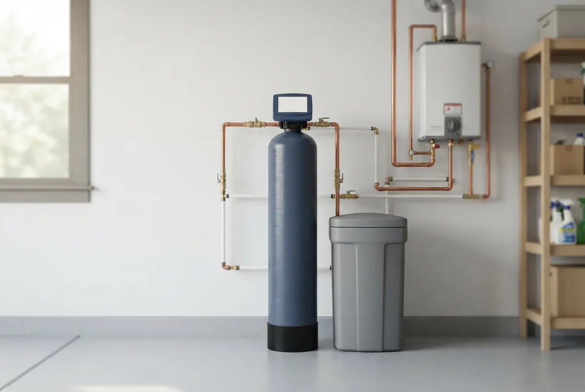
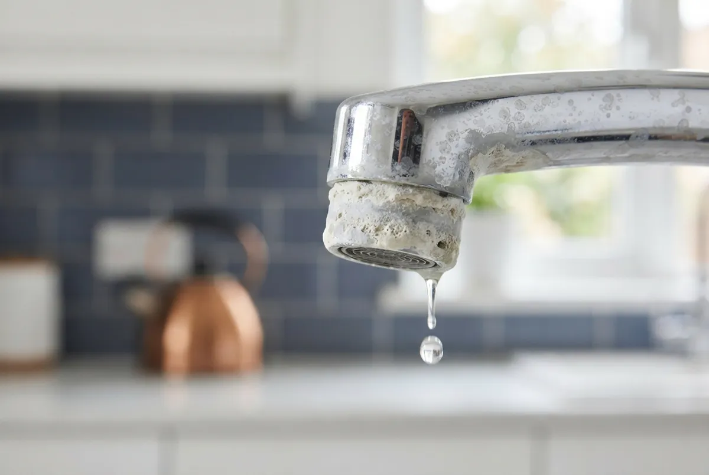

## Why Lubbock Elite Water Softener is Lubbock's Most Trusted Water Softener Company

Homeowners choose a water softener company on five things: who does the work, how the system is backed, how fast help arrives, whether the installer knows local water, and what happens if the result disappoints. Here is how Lubbock Elite Water Softener answers each one.

- **Experience:** Our founder has 14 years of experience. Every installation follows the same sizing and setup process.
- **Warranty:** Your estimate should state the warranty on the equipment and on the labor. Read it before you approve the work.
- **Licensed technicians:** In Texas, anyone who installs a water softener under contract must hold a TCEQ Water Treatment Specialist licence or be licensed by the Texas State Board of Plumbing Examiners. Ask any installer, us included, for the licence number and proof of insurance before work starts.
- **Local West Texas expertise:** Our technicians work with Ogallala Aquifer groundwater and the blended city supply every week, so they size systems for the water that actually comes out of Lubbock taps.
- **Fast scheduling:** Call early in the day and ask what is open. Same-day service depends on technician availability.
- **Clear scope and price:** Your free estimate is itemized, so you see what is included before work starts.

## Water Softener Services in Lubbock, TX

Lubbock Elite Water Softener covers six core services, from first installation to long-term maintenance, and adds specialty systems for larger homes, businesses and wells.

### Water Softener Installation
Installation connects a new softener to your home's main water line so every faucet, shower and appliance receives softened water. A technician sizes the unit to your household and water use, fits a bypass valve, sets the drain and brine line, programs the control head and tests the result before leaving.

### Water Softener Replacement
Replacement removes an old or failing softener and installs a new, correctly sized unit on the existing plumbing. It covers full system replacement, resin bed replacement and upgrades for systems that no longer soften, leak, or cost more to repair than they are worth.

### Salt-Free Water Softener Systems
A salt-free system conditions hard water so scale no longer clings to pipes and fixtures. It does not remove calcium and magnesium, needs no salt and no drain line, and fits homeowners who want lower maintenance over full softening.

### Water Softener Repair & Service
Repair and service restores softeners that stop regenerating, leave hard water, run out of salt too fast or leak at the control head. Routine service includes resin and brine tank checks, cleaning, salt refills and valve testing.

### Whole House Water Filtration
Whole house filtration treats water where it enters the home, reducing chlorine taste and sediment before it reaches every tap. It pairs with a softener because filtration and softening solve different problems.

### Water Quality Testing
A water quality test measures hardness, iron, pH, total dissolved solids and other values that decide which system fits. It is the first step of every recommendation we make.

We also install dual tank and commercial water softeners, water conditioners, reverse osmosis and UV purification, drinking water systems, well water treatment and contaminant removal filters.

## Lubbock's Hard Water Problem

Lubbock's water is hard because of where it comes from. According to City of Lubbock water quality reports, groundwater from the Ogallala Aquifer, pumped from the Roberts County and Bailey County well fields, supplies roughly 60 to 70 percent of the city's water. Surface water from Lake Alan Henry and Lake Meredith supplies most of the rest. Groundwater that has moved through the minerals of the High Plains picks up dissolved calcium and magnesium, and those two minerals define hardness.

Hardness is measured in milligrams per liter (mg/L) or grains per gallon (gpg), where 1 gpg equals about 17.1 mg/L. The U.S. Geological Survey rates water under 60 mg/L as soft, 61 to 120 mg/L as moderately hard, 121 to 180 mg/L as hard and anything over 180 mg/L as very hard. City of Lubbock Water Utilities reports average hardness at approximately 205 mg/L, or 12 grains per gallon, classified as Very Hard by the Water Quality Association. A free water test shows the exact reading at your tap, because supply mix and home plumbing both move the number.

Hard water leaves marks across the whole house:

- **Appliances:** Scale builds inside water heaters, dishwashers and washing machines, forcing them to work harder and shortening their service life.
- **Pipes and fixtures:** Mineral deposits narrow pipes, clog showerheads and leave white crust on faucets.
- **Skin and hair:** Hard water reacts with soap to form a film that leaves skin dry and hair dull.
- **Laundry:** Minerals stiffen fabric, dull colors and make detergent less effective.

A water softener removes calcium and magnesium through ion exchange and replaces them with sodium or potassium, so scale stops forming and soap lathers properly. For Lubbock homeowners, that single change protects the water heater, the plumbing and the fixtures at the same time.

## Our Simple 4-Step Water Softener Installation Process

1. **Free Consultation:** We talk through your household size, water use and what you notice at the tap, then book a visit at a time that suits you.
2. **Water Testing & System Recommendation:** A technician tests your water, measures hardness and recommends a softener size and type, with a written, itemized price.
3. **Professional Installation:** A qualified technician installs the system, connects the drain and brine line, programs the control head and tests every tap. A standard install typically takes about 2 to 4 hours.
4. **Ongoing Support & Maintenance:** We explain salt refills and settings, check the system at follow-up visits and answer questions after the job is done.

## Frequently Asked Questions About Water Softeners in Lubbock, TX

Most questions homeowners ask before buying fall into eight areas: water hardness, cost, system choice, timeline, water source, upkeep and where we work.

### How hard is Lubbock water?
Lubbock water is hard. Roughly 60 to 70 percent of it comes from the Ogallala Aquifer, which carries dissolved calcium and magnesium, and City of Lubbock Water Utilities reports average hardness at approximately 205 mg/L, or 12 grains per gallon, classified as Very Hard by the Water Quality Association. Hardness differs by neighborhood and by supply mix, so a free test at your tap gives the number that matters for sizing.

### How much does water softener installation cost in Lubbock, TX?
Installed price depends on system capacity, system type, plumbing layout and whether a drain line already exists. A standard salt-based system typically runs $1,800 to $3,200 installed, depending on grain capacity, dual-tank options and valve type. The free estimate gives an itemized price for your home before any work begins.

### What is the best water softener for Lubbock water?
The best system matches your household size and your test results. A salt-based softener removes hardness minerals and suits the harder end of Lubbock readings, and the technician sizes its capacity to your daily water use. Salt-free systems suit homeowners who prioritize low maintenance.

### Salt vs. salt-free water softener: what is the difference?
A salt-based softener removes calcium and magnesium through ion exchange and needs salt refills and a drain. A salt-free system conditions the water so scale does not stick, adds no sodium, and leaves the minerals in the water. Salt-based units deliver true softening, while salt-free units reduce scale.

### How long does water softener installation take?
Most installations finish in a single visit, typically in about 2 to 4 hours. The technician confirms the timeline at your estimate, based on plumbing access and system type.

### Do I need a water softener with city water or well water in Lubbock?
Both benefit. City water is a blend of Ogallala groundwater and surface water, and it still arrives hard. Private well water draws directly from the aquifer and can be harder and carry iron or other minerals. Nobody tests a private well for you, so a test shows whether a softener alone is enough.

### How often does a water softener need maintenance?
Check the salt level monthly and refill when it drops below one-third full. Have a technician service the system once a year to inspect the resin bed, brine tank and valve.

### What areas do you serve?
We serve Lubbock and surrounding West Texas communities, including Wolfforth, Shallowater, Slaton, Idalou, Levelland, Plainview, Floydada, Tahoka, Brownfield, Post, Lamesa and Crosbyton.

## Lubbock Areas We Serve

Lubbock Elite Water Softener provides water softener installation, replacement, repair and water testing across Lubbock and the South Plains, including Wolfforth, Shallowater, Slaton, Idalou, Levelland, Plainview, Floydada, Tahoka, Brownfield, Post, Lamesa and Crosbyton. Whether your home uses city water or a private well, call or request a free estimate and we will confirm service to your address.
